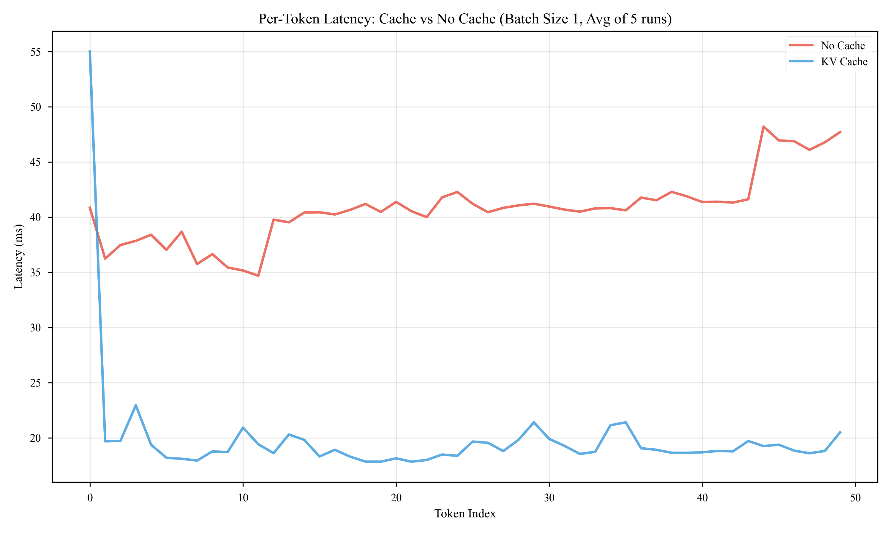

# nanoGPT-inference-optimization

**A specialized fork of nanoGPT focused on inference optimization, starting with Key-Value (KV) Caching.**


## 🚀 Overview

Large Language Models (LLMs) like GPT-2 are autoregressive: they generate text one token at a time. A naive implementation re-computes the attention for *all* previous tokens at every step, leading to **O(N²)** complexity.

This repository implements **KV Caching**, a critical optimization that caches the Key and Value vectors of past tokens. This allows the model to compute attention only for the *new* token, reducing the complexity of generation to **O(N)**.

## 📊 Benchmark Analysis

We benchmarked the implementation on a standard CPU environment using GPT-2 (124M). The benchmark script (`benchmark_kv.py`) measures three key metrics across various batch sizes:

1.  **TTFT (Time To First Token)**: The latency to process the prompt and generate the first token (prefill phase).
2.  **TTPT (Time Per Token)**: The average latency to generate each subsequent token (decoding phase).
3.  **Throughput**: The total number of tokens generated per second.

### Results (CPU)


**Key Findings:**
*   **Throughput**: KV Cache (Blue) maintains high throughput as batch size increases, reaching **~635 tokens/sec**. Without cache (Red), throughput collapses because the O(N^2) complexity dominates.
*   **TTPT Stability**: With KV Cache, the time per token remains constant. Without it, TTPT grows linearly with sequence length, making generation progressively slower.
*   **Memory**: KV Cache requires memory (Purple line), which grows linearly with batch size. This is the trade-off for speed.

### Per-Token Latency Trace

To visualize the "why", here is the latency for every single token generated in a sequence (Batch Size 1), averaged over 5 runs:



*   **No Cache (Red)**: Latency increases with every new token (linear growth). The model has to re-process the entire history every time.
*   **KV Cache (Blue)**: After the first token (prefill), latency is flat and constant. The model only processes the one new token.

## 🧠 Visualization

To understand *how* the KV cache works, we built an animated dashboard (`visualize_kv.py`).


*   **Query (Top)**: The vector for the *current* token being generated.
*   **Key Cache (Left)**: The stored keys for all previous tokens. The heatmap shows the activation patterns.
*   **Attention (Right)**: The computed attention scores. Note how the model "attends" to specific past tokens.
*   **Value Cache (Center)**: The stored values that will be weighted by the attention scores to form the output.

## 🛠️ Implementation Details

The core changes were made in `model.py`:

1.  **`CausalSelfAttention.forward`**: Modified to accept `past_kv` (the cache) and return `new_kv` (the updated cache).
2.  **`GPT.generate`**: Updated the generation loop to:
    *   Pass the full prompt for the first step (prefill).
    *   Pass only the *last generated token* for subsequent steps (decoding).
    *   Maintain the `past_kv` state across steps.

## 💻 Usage

### 1. Installation
```bash
pip install torch numpy matplotlib tiktoken
```

### 2. Run Benchmark
Run the comprehensive benchmark suite to generate the metrics and plots:
```bash
python benchmark_kv.py
```

### 3. Run Visualization
Generate the animated GIF dashboard:
```bash
python visualize_kv.py
```

## 📂 Repository Structure

*   `model.py`: The optimized GPT-2 model with KV Caching.
*   `model_original.py`: The original, unoptimized implementation (for reference).
*   `benchmark_kv.py`: Advanced benchmarking script (TTFT, TTPT, Throughput).
*   `visualize_kv.py`: Visualization tool for KV cache dynamics.
*   `train.py`: (Original) Training script.

---
*Forked from [karpathy/nanoGPT](https://github.com/karpathy/nanoGPT)*
